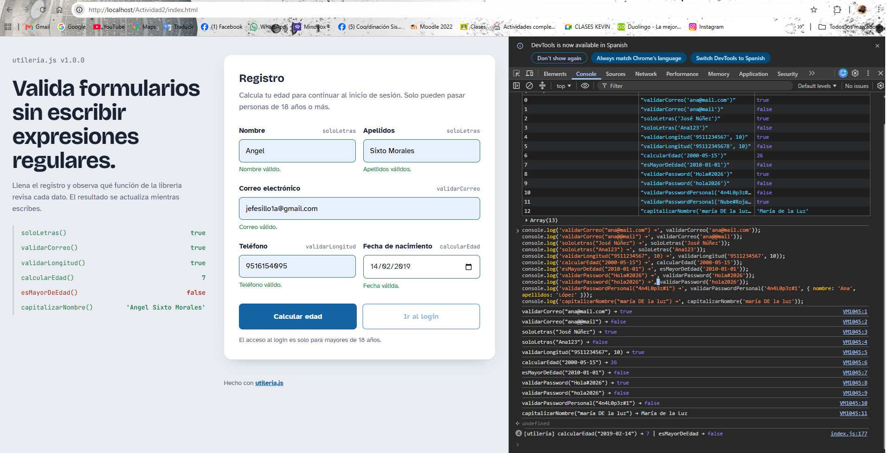
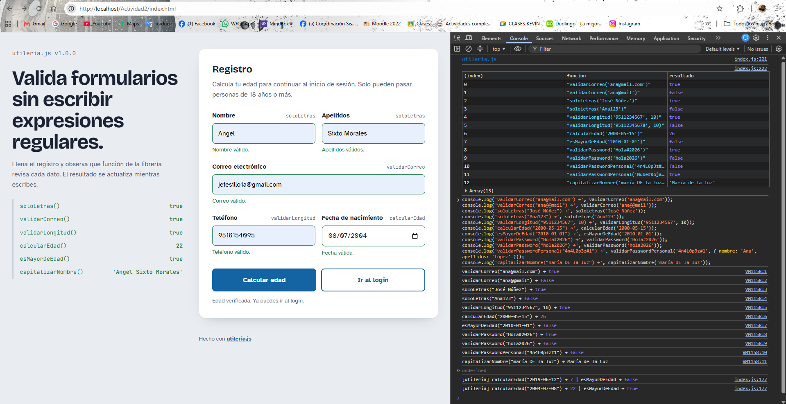
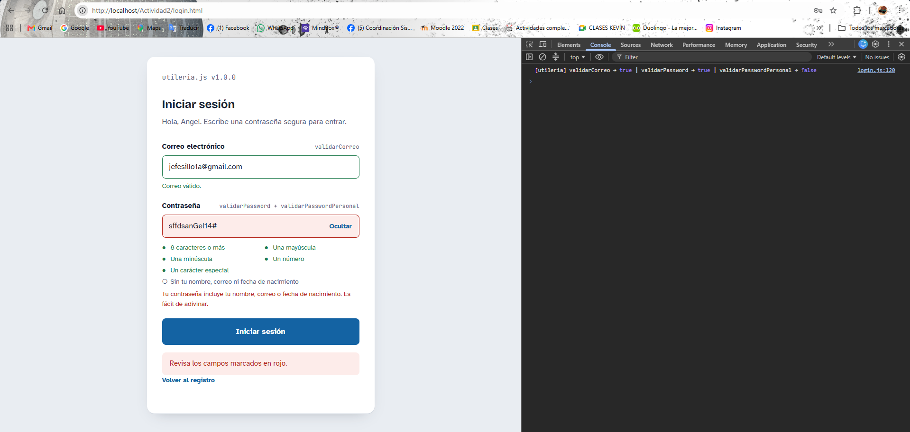
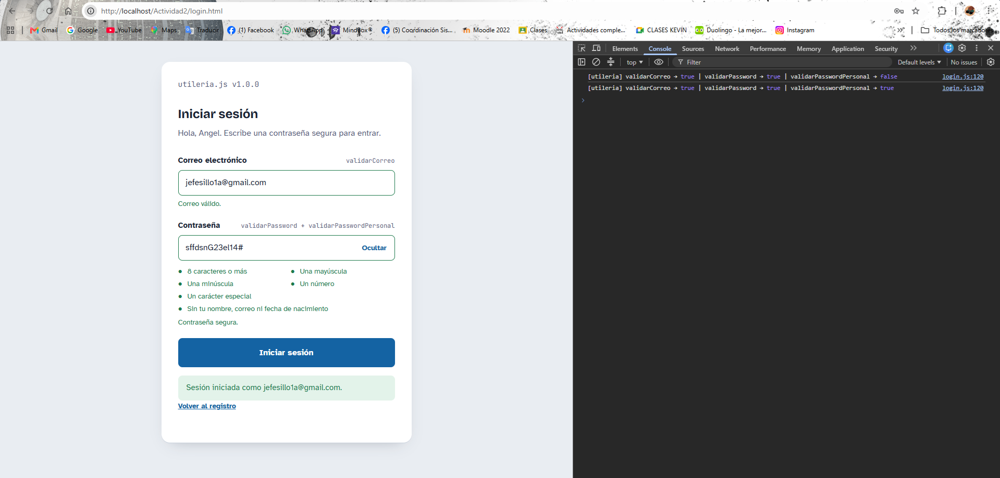
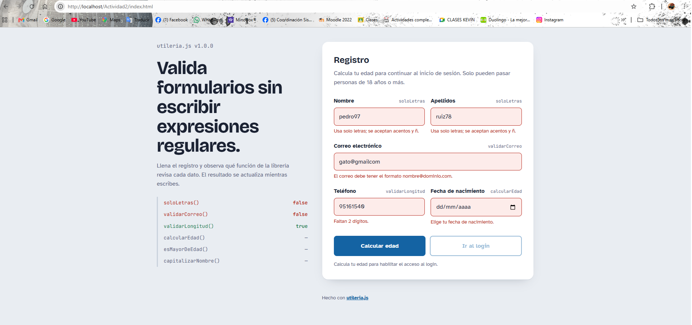
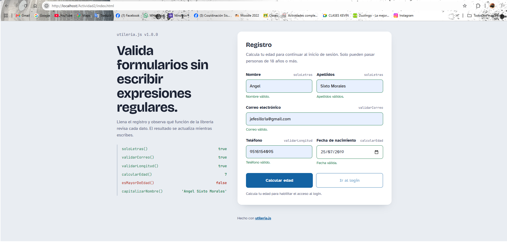
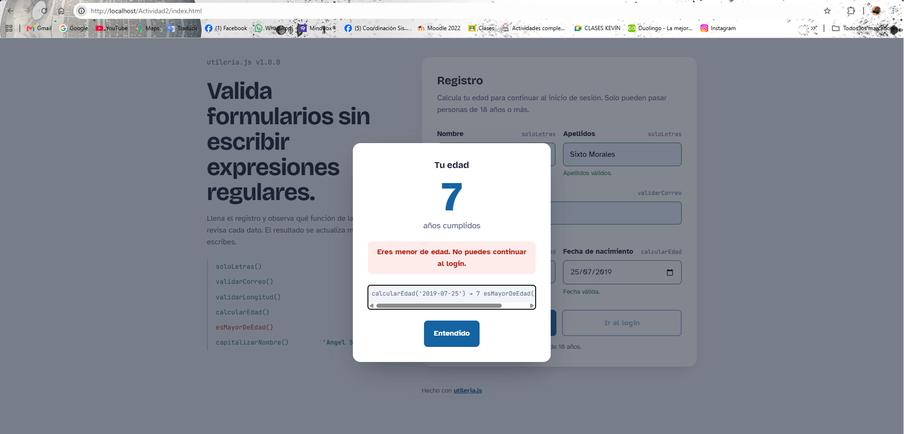
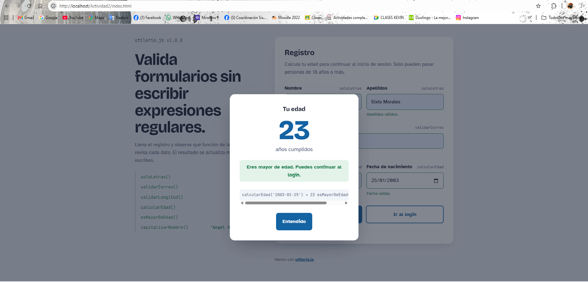
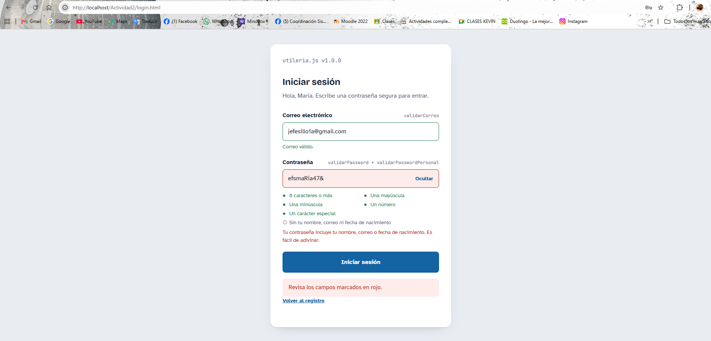
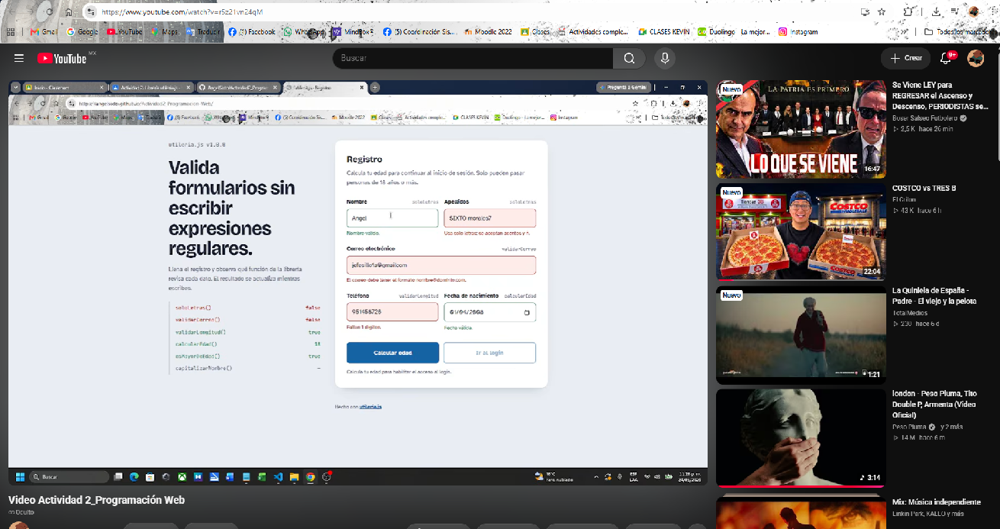

# utileria.js

**Autor:** Angel Sixto Morales

**Validaciones listas para formularios, en una sola línea de `<script>`.**

Validar correos, nombres con acentos, teléfonos, edades y contraseñas (incluso detectar si una contraseña usa tus datos personales) suele terminar en expresiones regulares copiadas de internet, repetidas en cada proyecto y con errores (como fechas que se recorren un día por la zona horaria). `utileria.js` reúne esas validaciones en una librería ligera, sin dependencias y sin frameworks, que cualquiera puede cargar desde un CDN.

---

## Instalación

### Archivo local

Descarga `js/utileria.js` y agrégalo antes de tu código:

```html
<script src="utileria.js"></script>
```

### ¿Cómo se llaman las funciones?

Al cargarla en el navegador se crea el objeto global `Utileria`. Además, cada función queda disponible directamente (por ejemplo `validarCorreo()`), siempre que tu página no tenga ya algo con ese nombre. Si quieres evitar conflictos, usa siempre la forma `Utileria.nombreFuncion()`.

```js
validarCorreo('ana@mail.com');          // forma corta
Utileria.validarCorreo('ana@mail.com'); // forma segura
```

---

## Funciones

| Función | Devuelve | Descripción |
|---|---|---|
| `validarCorreo(correo)` | `boolean` | Valida el formato de un correo electrónico |
| `soloLetras(texto)` | `boolean` | Solo letras mayúsculas/minúsculas, acepta acentos, ü y ñ |
| `validarLongitud(numero, maxLongitud)` | `boolean` | Solo dígitos y longitud menor o igual al máximo |
| `calcularEdad(fechaNacimiento)` | `number` | Edad en años cumplidos (`NaN` si la fecha es inválida o futura) |
| `esMayorDeEdad(fechaNacimiento)` | `boolean` | `true` si tiene 18 años o más |
| `validarPassword(password)` | `boolean` | Mayúscula, minúscula, número, carácter especial y mínimo 8 caracteres |
| `validarPasswordPersonal(password, datos)` | `boolean` | **Función propia.** Revisa que la contraseña no contenga datos personales del usuario |
| `capitalizarNombre(texto)` | `string` | **Función propia.** Da formato de nombre propio |

---

## Uso con ejemplos

### validarCorreo(correo) → boolean

Valida que el texto tenga la forma `usuario@dominio.ext`. Rechaza espacios, dobles arrobas y puntos seguidos.

```js
validarCorreo('ana.lopez@gmail.com'); // true
validarCorreo('ana@mail');            // false (sin extensión)
validarCorreo('ana@@mail.com');       // false
validarCorreo('ana..lopez@mail.com'); // false (puntos seguidos)
```

```html
<input id="correo" type="email">
<script>
  document.getElementById('correo').addEventListener('blur', function () {
    if (!validarCorreo(this.value)) {
      alert('Correo no válido');
    }
  });
</script>
```

### soloLetras(texto) → boolean

Acepta letras mayúsculas y minúsculas, vocales acentuadas, `ü` y `ñ`. Permite un espacio entre palabras para nombres compuestos.

```js
soloLetras('María');        // true
soloLetras('José Núñez');   // true
soloLetras('Ana123');       // false
soloLetras('Ana_Lopez');    // false
soloLetras('');             // false
```

### validarLongitud(numero, maxLongitud) → boolean

Revisa que el valor contenga solo dígitos y que no supere la longitud máxima. Acepta número o texto.

```js
validarLongitud('9511234567', 10);  // true
validarLongitud(12345, 5);          // true
validarLongitud('95112345678', 10); // false (11 dígitos)
validarLongitud('95a1', 10);        // false (tiene una letra)
```

Para exigir una longitud exacta (como un teléfono de 10 dígitos):

```js
const tel = '9511234567';
const esTelefono = validarLongitud(tel, 10) && tel.length === 10; // true
```

### calcularEdad(fechaNacimiento) → number

Recibe el valor de un `<input type="date">` (`"AAAA-MM-DD"`) o un objeto `Date`. Calcula la fecha en hora local, así que no se recorre un día por la zona horaria.

```js
calcularEdad('2000-05-15');           // 26 (en septiembre de 2026)
calcularEdad(new Date(1995, 11, 25)); // 30
calcularEdad('2030-01-01');           // NaN (fecha futura)
calcularEdad('2024-02-31');           // NaN (fecha que no existe)
```

```html
<input id="fecha" type="date">
<button id="btn">Calcular</button>
<script>
  document.getElementById('btn').addEventListener('click', function () {
    const edad = calcularEdad(document.getElementById('fecha').value);
    console.log('Edad:', edad);
  });
</script>
```

### esMayorDeEdad(fechaNacimiento) → boolean

```js
esMayorDeEdad('2000-05-15'); // true
esMayorDeEdad('2010-01-01'); // false
esMayorDeEdad('fecha mala'); // false
```

### validarPassword(password) → boolean

Exige los cinco requisitos al mismo tiempo.

```js
validarPassword('Hola#2026'); // true
validarPassword('hola2026');  // false (sin mayúscula ni carácter especial)
validarPassword('HOLA#2026'); // false (sin minúscula)
validarPassword('Ho#1');      // false (menos de 8 caracteres)
```

---

## Sección libre: funciones propias

### validarPasswordPersonal(password, datos) → boolean

**Problema:** una contraseña como `Ana#2005` cumple con mayúscula, minúscula, número y símbolo, pero cualquiera que conozca a Ana puede adivinarla: es su nombre y su año de nacimiento. La mayoría de los formularios no revisan esto. Esta función compara la contraseña con los datos del usuario y devuelve `false` si encuentra alguno de ellos.

Qué revisa:

- Nombre y apellidos (cada palabra de 3 letras o más).
- La parte del correo antes de la `@` (por ejemplo `anita` en `anita.lopez99@gmail.com`).
- La fecha de nacimiento: año completo, día+mes y mes+día.
- Datos "disfrazados": ignora mayúsculas y acentos, y deshace sustituciones comunes como `4→a`, `3→e`, `1→i`, `0→o`, `5→s`, `7→t`, `@→a`, `$→s`.

```js
const datos = {
  nombre: 'Ana María',
  apellidos: 'López Cruz',
  correo: 'anita.lopez99@gmail.com',
  fechaNacimiento: '2005-03-17'
};

validarPasswordPersonal('Nube#Roja27', datos); // true  (no tiene datos personales)
validarPasswordPersonal('4n4L0p3z#1', datos);  // false (es "analopez" disfrazado)
validarPasswordPersonal('Mar1a#Luna', datos);  // false (contiene "maria")
validarPasswordPersonal('Gato#2005x', datos);  // false (año de nacimiento)
validarPasswordPersonal('Sol*1703pz', datos);  // false (día y mes: 17/03)
validarPasswordPersonal('Anita$22', datos);    // false (usuario del correo)
```

Se recomienda usarla junto con `validarPassword`:

```js
function passwordSegura(password, datos) {
  return validarPassword(password) && validarPasswordPersonal(password, datos);
}

passwordSegura('Ana#2005x', datos);   // false
passwordSegura('Nube#Roja27', datos); // true
```

### capitalizarNombre(texto) → string

**Problema:** los usuarios escriben su nombre como sea (`"JUAN pérez"`, `"  maría  de la luz"`). Esta función lo deja con formato de nombre propio, quita espacios de sobra y respeta partículas como *de*, *del*, *la* o *y*.

```js
capitalizarNombre('  maría   DE la  luz '); // 'María de la Luz'
capitalizarNombre('JUAN PÉREZ');            // 'Juan Pérez'
capitalizarNombre('ana y lópez');           // 'Ana y López'
```

---

## Demo incluida

| Archivo | Qué hace |
|---|---|
| `index.html` | Formulario de registro. Usa `soloLetras`, `validarCorreo`, `validarLongitud`, `calcularEdad`, `esMayorDeEdad` y `capitalizarNombre`. El botón **Calcular edad** muestra la edad en una ventana modal. El botón **Ir al login** solo se habilita si ya se calculó la edad y es de 18 años o más. |
| `login.html` | Inicio de sesión con `validarCorreo`, `validarPassword` y `validarPasswordPersonal`. Recibe el nombre, apellidos, correo y fecha del registro, y no deja usar una contraseña que los contenga. Muestra la lista de requisitos en tiempo real. |

El código de cada página está separado de la librería: `index.html` usa `js/index.js` y `login.html` usa `js/login.js`. Así `utileria.js` contiene únicamente las validaciones y se puede usar en cualquier proyecto.

Al abrir `index.html`, la consola del navegador (F12 → Consola) muestra una tabla con ejemplos de todas las funciones.

---

## Capturas de pantalla

### Consola mostrando resultados






### Formulario con validaciones




### Ventana modal con la edad




### Login




---

## Video demo

[](URL_DEL_VIDEO)

Enlace directo: https://youtu.be/r5z21vn24qM

---

## Estructura del repositorio

```
Actividad2/
├── README.md
├── index.html
├── login.html
├── css/
│   └── styles.css
├── js/
│   ├── utileria.js   ← la librería (solo validaciones)
│   ├── index.js      ← código del formulario de registro
│   └── login.js      ← código del inicio de sesión
└── img/
    └── (capturas de pantalla)
```

